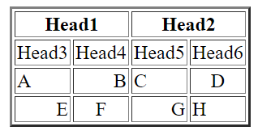
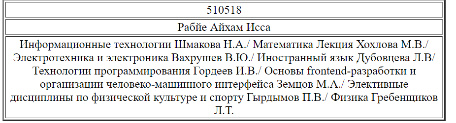

МИНИСТЕРСТВО НАУКИ И ВЫСШЕГО ОБРАЗОВАНИЯ

РОССИЙСКОЙ ФЕДЕРАЦИИ

ФЕДЕРАЛЬНОЕ ГОСУДАРСТВЕННОЕ БЮДЖЕТНОЕ ОБРАЗОВАТЕЛЬНОЕ

УЧРЕЖДЕНИЕ ВЫСШЕГО ОБРАЗОВАНИЯ

«ВЯТСКИЙ ГОСУДАРСТВЕННЫЙ УНИВЕРСИТЕТ»

Институт математики и информационных систем

Факультет автоматики и вычислительной техники

Кафедра систем автоматизации управления

 

Дата сдачи на проверку:

«28» Апреля 2021 г.

Проверено:

«__» Апреля 2021 г.

Методы формирования html5 документов

Отчет по лабораторной работе № 1

по дисциплине

«Основы frontend-разработки и организации человеко-машинного интерфейса»

Вариант 0.

  

Разработал студент гр. ИТб-1303-01-00 ________________ /Рабие А.И/

Проверил ст. преподаватель _________________ /Земцов М.А./

Работа защищена с оценкой	«___________» «___» __________ 2021 г.

   

Киров 2021. 

---

 Цель лабораторной работы: изучение методов формирования html5 документов на стороне клиентов.

 Изучить структуру html5 документов. Создайте HTML-страницу index4.html, разделенную на фреймы в соответствии с номером варианта. 
В качестве заголовка страницы использовать имя, фамилию и отчество. Фреймы должны содержать (рис. 1):  

№1 – номер зачетной книжки; 

№2 – таблицу (рис.2); 

№3 – ваше имя, отчество и фамилию; 

№4 – список дисциплин и преподавателей текущего семестра.  

Рисунок 1

Рисунок 2 

2

---

---

<b> Ответить на вопросы.</b>  

•	Какие из тегов являются тегами форматирования абзацев?
	 Тег hr создает горизонтальный разделитель между блоками текста, для перехода на другую строку текста служит пустой элемент br, тег p является самим тегом абзаца.

•	В чем различия тегов h?
	 Тег h1 является самым верхним в иерархии оглавлений и, соответственно, самым большим, h6 же самым нижним и самым маленьким.

•	Для чего применяется тег Code, как его использовать?
	 Тег code предназначен для отображения одной или нескольких строк текста, который представляет собой программный код. Сюда относятся имена переменных, ключевые слова, тексты функции и т.д. Синтаксис code Код /code.

•	В чем различие тегов code, kbd, samp, var, pre?
	 Тег kbd выделяет текст, который должен быть введён пользователем с клавиатуры. Тег samp используется для вывода текста, представляющего результат выполнения программного кода или скрипта, а также системные сообщения. Тег var выделяет переменные из программ, отображая их курсивом. Тег pre выводит текст без форматирования, с сохранением пробелов и переносов текста.

•	В чем отличие тегов оформления цитат и определений от тегов обычного форматирования текста?
	 Теги оформления цитат и определений предназначены для выделения аббревиатур, длинных и коротких цитат, источника цитат, что значительно упрощает процесс формирования html страницы.

•	Для чего применяются теги p, br и hr?
	Данные теги применяют для разделения текста. Тег p определяет текстовый абзац. Тег br предназначен для переноса текста на новую строку. Тег hr создает горизонтальную линию для тематического разделения параграфов.

•	Какая разница в тегах span и p?
	 Тег span предназначен для определения строчных элементов документа. В отличие от блочного элемента p, с помощью тега span можно выделить часть информации внутри других тегов и установить для нее свой стиль.

•	В чем разница между тегами b и strong?
	 Тег strong является тегом логической разметки, а b просто делает текст жирным, не прибавляя к этому никакой смысловой нагрузки.

Вывод:
Мы познакомились с частью базовых функций HTML.

4

---
